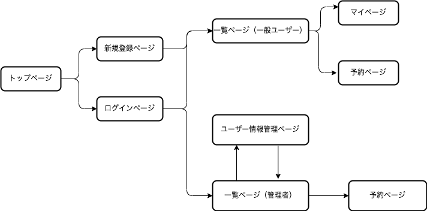

# README
  
# アプリケーション名
NNails

# アプリケーション概要
一コマにつき１名まで予約を行なうことができ、管理者は予約情報をカレンダーに一覧表示された状態で確認できる。

# URL
https://nnails.herokuapp.com

# テスト用アカウント
Basic認証ID: hoge  
Basic認証パスワード: 123456  
管理者メールアドレス: admin@admin  
管理者パスワード: 111111  

# 利用方法
## 客サイド
1. トップページ右上の新規登録ページへのリンクからユーザー登録を行なう（備考欄を除いて空欄不可）
2. カレンダー内の「◯」をクリックして予約ページへ移動し、「送信する」ボタンをクリックする
3. 画面右上の自分の名前をクリックするとマイページへと遷移し、予約の削除を行なうことができる

## 管理者サイド
1. 予約管理ページでは、月間カレンダーに予約者の名前が入力されており確認できる
2. カレンダー内の「◯」をクリックすると予約ページへ飛び、お客の名前を選択して代わりに予約を入れることができる
3. ユーザー管理ページでは、お客の名前の一覧と直近の予約の情報が表示されていて、詳細ページへのリンクとユーザー情報削除のボタンを表示する

# アプリケーションを作成した背景
知人でネイルサロンを営業している人がいる人がいるが、今は手帳を用いた予約の管理をしている。空いている日を確認したり、予約情報の確認をわかりやすく行えるWebページを作ったら便利になるのではないかと考え作成した。

# 洗い出した要件

要件定義シートのURL
https://docs.google.com/spreadsheets/d/1Di9Z3s9z1GIxXKRfug0V5HeoNq8C65H8YOuLnPyNoCU/edit?usp=sharing

# 実装予定の機能
1. 予約の備考欄と画像の貼り付けを可能にすることで、希望するデザインの写真や特徴を合わせて登録できるようにする
2. 曜日や時間帯による検索ができるようにする

# テーブル設計

  

# 画面遷移図

  

# 開発環境
・Ruby on Rails  
・VSCode  
・MySQL  

# ローカルでの動作方法
以下のコマンドを順に実行  
% git clone https://github.com/nnails  
% cd nnails  
% bundle install  
% yarn install  
% rails db:migrate  
% rails s  

# 工夫したポイント
・高齢者でも使いやすいようにシンプルなWebアプリである  
・管理者が予約を管理しやすくするためのアプリである  
・カレンダーの上に日付の検索ボックスを用意して、日付を選択しやすくしている  